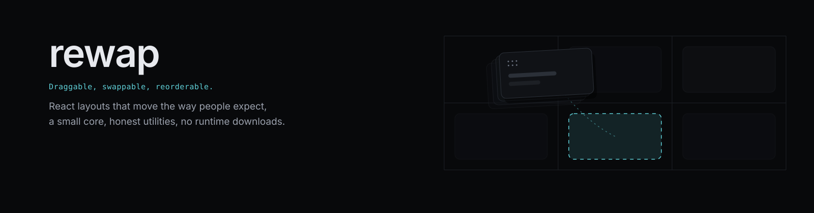
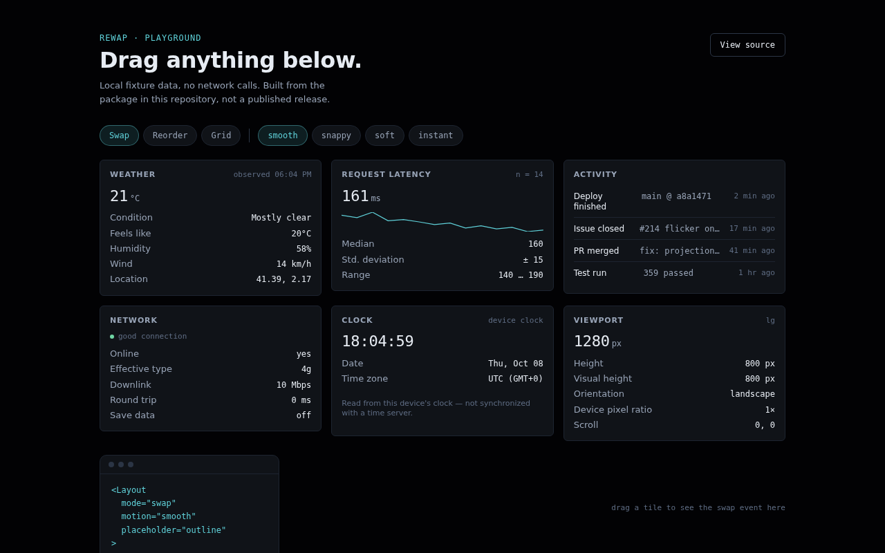

<div align="center">



<br>

**Draggable, swappable and reorderable layouts for React.**<br>
Built-in motion engine, TypeScript throughout, no runtime dependencies beyond React.

<br>

<a href="#quick-start"></a>&nbsp;
<a href="docs/content/api.md"></a>&nbsp;
<a href="examples/"></a>&nbsp;
<a href="https://www.npmjs.com/package/@nashiuso/rewap"></a>&nbsp;
<a href="https://github.com/nashiuso/rewap"></a>

[](https://www.npmjs.com/package/@nashiuso/rewap)
[](./LICENSE)
[](https://www.typescriptlang.org)
[](https://react.dev)
[](./package.json)

**1.1.1 — unreleased alpha.** Not published to npm yet. See [CHANGELOG.md](./CHANGELOG.md).

</div>

<br>

## Why

The interaction model should stay small. Geometry, motion, accessibility and real-world
edge cases belong underneath it, not in your code. Rewap is two components and a hook;
modes and physics are props.<br>
<sub>> nashiuso</sub>

## Features

- **Small API.** `<Layout>`, `<Item>`, `<Item.Handle />` and `useLayout()`. Everything else
  — math, motion, accessibility, providers, charts, widgets — is an explicit subpath import,
  not a root export you have to scroll past.
- **Three modes, one session.** `swap`, `reorder` and `grid` all share the same drag
  session: pointer, touch, keyboard and programmatic moves go through the same code path,
  so switching mode never remounts the tree and never drifts out of sync with keyboard input.
- **A real motion engine, not a transition class.** Springs, tweens and four presets
  (`smooth`, `snappy`, `soft`, `instant`) run on one shared `requestAnimationFrame` loop.
- **Measured geometry.** Slots come from `ResizeObserver`, not fixed pixel sizes — resize
  the window or the content and the layout re-measures itself.
- **Honest utilities.** `useBattery()`, `usePerformance()`, `useKeyboardLayout()` and friends
  report `supported: false` with a reason when the platform doesn't expose something, instead
  of returning a plausible-looking fake value. See
  [known limitations](docs/content/known-limitations.md) for the full list of what's
  genuinely missing.
- **Local-first.** The core makes zero network calls. External data (weather, IP lookups,
  anything) only happens through a provider you construct yourself, e.g.
  `createOpenMeteoProvider(...)`.
- **Accessible by default.** Full keyboard grammar, ARIA wiring, a live region for
  announcements, and a `prefers-reduced-motion` path that collapses every animation to one
  instant step without disabling dragging.
- **SSR-safe.** Nothing touches `window` or `document` during render. Works with Next.js,
  Astro (`client:visible`/`client:load` — see [examples/astro](examples/astro)), and anything
  else that renders to a string on the server first.
- **A CLI that doesn't phone home.** `npx @nashiuso/rewap init` scaffolds from templates
  bundled in the package — see [CLI](#cli) below.

## Installation

```bash
npm install @nashiuso/rewap
```

[_React 18_](https://18.react.dev/) is the only peer dependency. Nothing else is needed at runtime.

### Entry points

Small core, explicit extras. Optional entry points are bundled **only when imported**.

```tsx
import { Layout, Item } from "@nashiuso/rewap"; // core
import "@nashiuso/rewap/styles.css"; // scoped styles

import { Chart } from "@nashiuso/rewap/charts"; // optional
import { StatsWidget } from "@nashiuso/rewap/widgets"; // optional
import { useWeather } from "@nashiuso/rewap/utilities"; // optional
import { createOpenMeteoProvider } from "@nashiuso/rewap/providers"; // optional · external data
```

## Quick start

```tsx
import { Item, Layout } from "@nashiuso/rewap";
import "@nashiuso/rewap/styles.css";

const panels = ["weather", "traffic", "notes", "activity"];

export const Dashboard = () => (
  <Layout
    mode="reorder"
    placeholder="auto"
    motion="smooth"
    onSwap={console.log}
  >
    {panels.map((id) => (
      <Item key={id} id={id} label={id}>
        {id}
      </Item>
    ))}
  </Layout>
);
```

Drag with a pointer, a finger, or `Space` and the arrow keys. Everything else is opt-in.

## API

| Export            | Role                                                                                                                                      |
| :---------------- | :---------------------------------------------------------------------------------------------------------------------------------------- |
| `<Layout>`        | Container: mode, motion, placeholder, history, persistence, collision.                                                                    |
| `<Item id>`       | Draggable unit: `label`, `draggable`, `disabled`, `handleOnly`, `effects`, `motion`, `columnSpan`.                                        |
| `<Item.Handle />` | Restricts dragging to a grip inside the item.                                                                                             |
| `useLayout()`     | Moves from code: `move`, `swap`, `grab`, `release`, `undo`, `redo`, `reset`, `announce`, `scrollIntoView`, `ids`, `renderIds`, `element`. |
| `createRewap()`   | Framework-neutral entry point into `core/` — no React import, for building a different binding.                                           |

Full reference in [_`docs/content/api.md`_](docs/content/api.md) (or the built docs site —
see [Documentation](#documentation)).

<details>
<summary><b>Configuration example</b></summary>

<br>

```tsx
<Layout
  mode="reorder" // swap | reorder | grid
  items={items} // controlled…
  onChange={setItems} // …or defaultItems + internal state
  onSwap={handleSwap} // fires while the destination changes
  collision="projection" // pointer | center | intersection | nearest | projection
  placeholder="outline" // auto | outline | ghost | none
  renderPlaceholder={({ item }) => <div className="slot">{item}</div>}
  motion={{ type: "spring", stiffness: 220, damping: 24 }}
  history={{ enabled: true, limit: 50 }}
  persistence={{ key: "dashboard", storage: "localStorage" }}
  keyboard={{ step: 1, largeStep: 3 }}
  snap={{ enabled: true, threshold: 18 }}
  label="Dashboard panels"
/>
```

`onSwap` payload:

```ts
{
  (item, previousSlot, nextSlot, position, velocity);
}
```

</details>

## CLI

```bash
npx @nashiuso/rewap init my-app --template react   # or --template astro
npx @nashiuso/rewap doctor                         # checks a project against the library's assumptions
npx @nashiuso/rewap info                           # what's installed, and its entry points
```

Templates are bundled in the published package — `init` never downloads anything, and
`doctor` reports real findings (peer dependency version, whether styles.css is imported,
whether a bundler will tree-shake the subpath exports correctly), not a canned "all good."

## Examples

One playground, not a gallery — see [why](NOTES.md#on-not-building-eight-example-apps) — plus
an Astro example proving SSR hydration. Both build from this repository's own source, no CDN:

```bash
npm install
npm run examples:dev   # -> http://localhost:5173
```

<p align="center">
  
</p>

See [docs/content/examples.md](docs/content/examples.md) for what's actually in there.

## Documentation

A full docs site builds from `docs/content/*.md` — plain static HTML, self-hosted fonts, a
client-side search box, no framework and no CDN:

```bash
npm run docs:dev   # builds once if needed, then serves docs/dist at :4321
```

Covers installation, every mode (`swap`/`reorder`/`grid`), collision strategies, motion,
physics, persistence, providers, accessibility, keyboard behavior, performance,
charts/widgets, Astro/SSR, and [known limitations](docs/content/known-limitations.md).
Once this repository is pushed and Pages is configured (see
[docs/maintainers/github.md](docs/maintainers/github.md)), the same site and the playground
are hosted together at `https://nashiuso.github.io/rewap/`.

## Utilities

Browser hooks from `@nashiuso/rewap/utilities`. Each reports what the browser exposes, and says so when it exposes nothing.

| Hook                     | Availability     | Notes                                                              |
| :----------------------- | :--------------- | :----------------------------------------------------------------- |
| `useViewport()`          | Local            | Size, orientation, breakpoint, visual viewport height.             |
| `useKeyboardLayout()`    | Local            | Platform, modifiers, language. Physical layout reports `null`.     |
| `usePerformance()`       | Browser          | FPS, frame time, long tasks, memory. CPU temperature: unsupported. |
| `useNetworkInfo()`       | Browser          | Online state, `effectiveType`, `downlink`, `rtt`, `saveData`.      |
| `useConnection()`        | Browser          | Same data as a label for a badge.                                  |
| `useBattery()`           | Chromium         | `supported: false` elsewhere.                                      |
| `useEmailVerification()` | Local + provider | Syntax checks offline; remote checks via your provider.            |
| `useWeather()`           | Provider         | Never geolocates without an explicit source.                       |

## Accessibility

| Area               | Behavior                                                                                                                                     |
| :----------------- | :------------------------------------------------------------------------------------------------------------------------------------------- |
| **Keyboard**       | `Space`/`Enter` grab · arrows move · `Shift`+arrow moves 3 · `Home`/`End` jump · `Esc` cancels                                               |
| **History**        | `Cmd/Ctrl+Z` undo · `Cmd/Ctrl+Shift+Z` or `Ctrl+Y` redo                                                                                      |
| **Screen readers** | List items with role description, shortcuts and hidden instructions. Grabs, moves and cancels announced via a live region created on demand. |
| **Reduced motion** | `prefers-reduced-motion: reduce` collapses every animation to one instant step. Dragging still works.                                        |
| **Focus**          | Follows the item through keyboard moves; returns to it after a drop.                                                                         |

## Performance

- One transform controller per element. React renders on status and destination changes, not per pointer event.
- One shared `requestAnimationFrame` loop for all animations.
- Slots are measured lazily and cached; `ResizeObserver` invalidates them.
- Core entry point: ~30 kB minified and gzipped. Run `npm run size` to measure locally.

## Browser support

Chromium, Firefox and Safari, current and previous major versions. Requires pointer events, `ResizeObserver`, `requestAnimationFrame` and `Intl`.

When an API is missing, the matching utility returns `supported: false` with a reason. Rewap does not guess.

Server rendering is supported: nothing touches the DOM during render, and layout is measured in an effect. See [known limitations](docs/content/known-limitations.md) for the one caveat this has (first-paint order vs. persisted order).

## Architecture

```text
src/
├─ core/            order, collision, drag session, history, persistence, keyboard
├─ react/           Layout, Item, engine hook, element state, FLIP
├─ motion/          springs, easing, ticker, presets
├─ math/            rects, grids, geometry, interpolation, statistics
├─ accessibility/   live region, keyboard grammar
├─ utilities/       browser hooks
├─ providers/       external data adapters
├─ charts/          optional SVG charts
├─ widgets/         optional widgets
├─ cli/             `rewap init/doctor/info` — bundled templates, no network
└─ styles/          tokens, scoped stylesheets
```

`core/` does not import React. Design notes live in [`docs/design/`](docs/design/); sparse,
honest maintainer commentary lives in [`NOTES.md`](NOTES.md) and
[`MAINTAINERS.md`](MAINTAINERS.md).

## Development

```bash
npm install
npm test              # vitest || jsdom || * layers
npm run test:e2e      # playwright || real browser
npm run build         # bundles || types || stylesheets
npm run docs:dev      # docs site      -> :4321
npm run examples:dev  # examples app   -> :5173
npm run site:build    # docs + playground assembled for GitHub Pages -> site-dist/
npm run ci            # format || typecheck || lint || tests || build || package checks
```

Browser tests need Chromium once per machine:

```bash
npx playwright install chromium             # local
npx playwright install --with-deps chromium # Linux CI: adds shared libraries
```

### Testing

- **Vitest + jsdom.** Synthetic geometry drives the real component tree: drag, swap, reorder,
  collision, motion, keyboard, touch, persistence, undo/redo, utilities, accessibility,
  reduced motion, charts and widgets. Public types are tested separately in `tests/types`.
- **Playwright.** `e2e/` covers what jsdom cannot: real pointer, layout and painting. Runs
  the built examples app in Chromium on desktop and emulated phone, plus a
  `reducedMotion: reduce` spec. Only the browser binary is downloaded, at test time, by you.

See [CONTRIBUTING.md](CONTRIBUTING.md) before sending a patch, and
[docs/maintainers/final-audit.md](docs/maintainers/final-audit.md) for the exact commands
that were run against this exact state of the repository.

## License

[MIT](./LICENSE) © [nashiuso](https://github.com/nashiuso)
